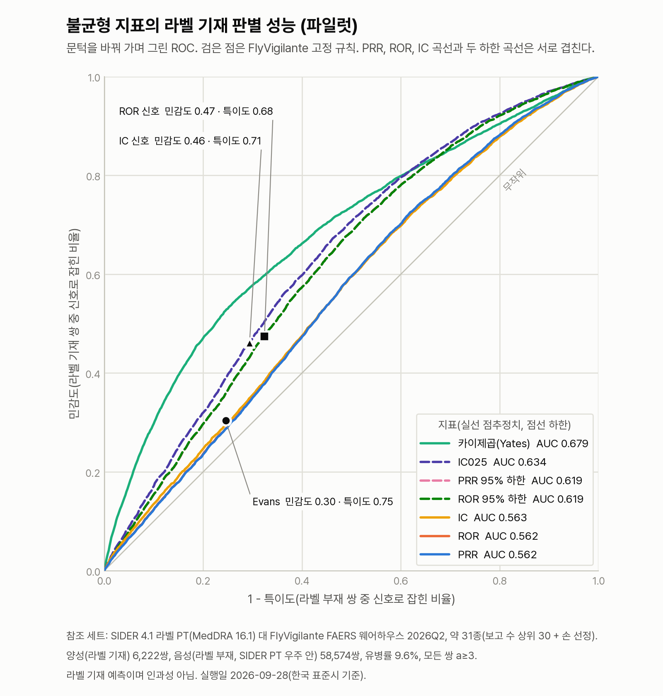

# 불균형 지표는 라벨 기재 쌍을 얼마나 골라내는가: 파일럿 실측

**읽는 사람:** 근거 등급과 신호 규칙을 맡은 팀원, 그리고 이 결과를 받아 볼 FlyVigilante 팀.

2026-09-28(한국 표준시) 측정. FlyVigilante FAERS 웨어하우스의 불균형 지표 일곱 개와 고정 규칙
셋이 SIDER 라벨에 적힌 쌍을 얼마나 골라내는지 쟀다. 지표는 PRR, ROR, Yates 보정 카이제곱, IC와
세 하한(PRR 95% 하한, ROR 95% 하한, IC025)이다. 결과 파일은
`eval/results/metric_validation_2026-09-28.json` 이고, 이 문서의 숫자는 모두 그 파일에서 왔다.

**결론을 먼저 적는다. Evans 규칙은 라벨 기재 쌍의 30%만 신호로 잡는다.** Evans 규칙 민감도 0.304다.
불균형 지표는 라벨 기재 여부를 약하게만 가른다. 일곱 지표의 AUC 0.56~0.68이다. 그리고 신뢰구간
하한이 점추정치보다 낫다. FlyVigilante가 ROR 하한과 IC025를 규칙에 쓴 것은 맞는 선택이다. 근거 등급이
쓰는 신호 조건(Evans 또는 ROR 신호)으로는 라벨 기재 쌍의 52.6%(3,273쌍)가 신호 없음으로 D를 받는다.

## 1. 무엇을 쟀는가

참조 세트는 약 하나와 MedDRA PT 하나로 된 쌍의 목록이다. 양성 쌍은 SIDER 4.1 라벨에 그 PT가
적힌 쌍이다. 음성 쌍은 같은 약의 SIDER 목록에 없고, SIDER 전체 PT 우주 4,251개 안에는 있는 PT의
쌍이다. 양성은 "라벨 기재"이지 인과성 확정이 아니고, 음성은 "라벨 부재"이지 "일어나지 않음"이
아니다. 두 쪽 모두 웨어하우스에 보고가 3건 이상(a≥3)인 쌍만 넣었다.

약은 다음 규칙으로 골랐다. SIDER `drug_names.tsv` 이름을 대문자로 바꿔 웨어하우스 성분명과
정확히 맞췄다. 여러 flat ID가 나눠 쓰는 이름 67개(flat ID 153개)는 어느 약인지 정할 수 없어서
뺐다. 남은 이름 1,277개 가운데 1,011종이 웨어하우스와 맞았고 266개는 맞지 않았다(`5-FU` 등).
맞은 약 가운데 FAERS 의심약 사례 수 상위 30종에 와파린을 손으로 더해 31종을 골랐다.
손 선정 약 가운데 클로자핀, 레날리도마이드, 아토르바스타틴은 이미 상위 30에 들었다.

| 항목 | 값 |
|---|---|
| 약 | 31종 |
| 양성 쌍 (라벨 기재) | 6,222쌍 |
| 음성 쌍 (라벨 부재) | 58,574쌍 |
| 유병률 | 9.6%. 양성 1쌍에 음성 9.41쌍 |
| 웨어하우스 | FlyVigilante FAERS 2012Q4~2026Q2, 55분기 |
| 웨어하우스 행이 없어 빠진 SIDER 양성 | 478쌍 |
| SIDER PT 우주 밖이라 빠진 웨어하우스 쌍 | 50,246쌍 (PT 8,828종) |

**SIDER는 MedDRA 16.1이고 웨어하우스는 2026Q2 보고의 현행 MedDRA다.** 이름은 PT 문자열로만
맞췄고 버전 사이 매핑은 하지 않았다. 그래서 SIDER PT 우주 밖의 쌍은 양성에도 음성에도 들어가지
않는다. 빠진 PT 가운데 보고 수가 많은 것은 `off label use`, `pyrexia`, `acute kidney injury`,
`product use in unapproved indication`, `peripheral swelling`, `chronic kidney disease`,
`covid-19` 등이다. 행정 용어뿐 아니라 발열 같은 임상 용어도 빠졌다는 점을 적어 둔다. SIDER 파일에서
`Pyrexia`는 PT 층에 나오지 않는다.

이전 실행(2026-09-27)은 첫 글자가 대문자인 이름을 상품명으로 보고 뺐다. 그 규칙이
`Abarelix`, `Carfilzomib`, `Goserelin` 같은 일반명까지 빼서 없앴다. 이번 실행에서 맞은 약은
1,011종이고, 선정된 31종은 이전 실행과 같다.

## 2. 결과

귀무 AUC는 양성 쌍의 PT를 약 사이에 뒤섞어 만든 "귀무 양성"으로 잰 값이다. 100회 반복했고 시드는
20260928부터 20261027까지다. 약별 AUC는 31종 각각에서 잰 값의 최소, 중앙, 최대다.

| 지표 | AUC | 귀무 AUC 평균 [2.5, 97.5 백분위] | 약별 AUC 최소 / 중앙 / 최대 |
|---|---|---|---|
| PRR | 0.562 | 0.465 [0.460, 0.470] | 0.447 / 0.576 / 0.843 |
| ROR | 0.562 | 0.465 [0.460, 0.471] | 0.447 / 0.576 / 0.844 |
| IC | 0.563 | 0.465 [0.460, 0.471] | 0.451 / 0.582 / 0.844 |
| PRR 95% 하한 | 0.619 | 0.520 [0.515, 0.525] | 0.502 / 0.644 / 0.866 |
| ROR 95% 하한 | 0.619 | 0.520 [0.515, 0.525] | 0.502 / 0.645 / 0.866 |
| IC025 | 0.634 | 0.535 [0.530, 0.540] | 0.522 / 0.667 / 0.870 |
| 카이제곱 (Yates) | 0.679 | 0.644 [0.637, 0.649] | 0.601 / 0.711 / 0.888 |

고정 규칙은 문턱이 하나라 ROC 위의 한 점이다. PPV는 유병률 9.6%에서의 값이다.

| 규칙 | 조건 | 민감도 | 특이도 | PPV |
|---|---|---|---|---|
| Evans | PRR≥2, 카이제곱≥4, a≥3 | 0.304 | 0.754 | 0.116 |
| ROR 신호 | ROR 95% 하한>1, a≥3 | 0.474 | 0.676 | 0.134 |
| IC 신호 | IC025>0 | 0.461 | 0.706 | 0.143 |
| 근거 등급의 신호 | Evans 또는 ROR 신호 | 0.474 | 0.676 | 0.134 |



## 3. 어떻게 읽는가

**Evans 규칙은 라벨 기재 쌍의 30%만 잡는다.** 양성 6,222쌍 가운데 1,889쌍만 신호가 섰고 4,333쌍은
서지 않았다. 문턱을 PRR≥2 하나로 바꿔도 민감도는 0.305로 거의 같다. 거꾸로 카이제곱≥4 하나만 쓰면
민감도는 0.841이지만 특이도가 0.319로 떨어진다.

**불균형 지표는 라벨 기재 여부를 약하게만 가른다.** AUC는 가장 낮은 PRR이 0.562, 가장 높은
카이제곱이 0.679다. 약별로 보면 IC025는 타크로리무스 0.522에서 아프레밀라스트 0.870까지 벌어진다.
어떤 약에서는 지표가 라벨을 잘 따라가고 어떤 약에서는 무작위에 가깝다.

**신뢰구간 하한이 점추정치보다 낫다.** 같은 계열에서 PRR 0.562가 PRR 하한 0.619로, IC 0.563이
IC025 0.634로 오른다. 하한은 보고가 적어 구간이 넓은 쌍을 뒤로 민다. 고정 규칙에서도 하한을 쓰는
ROR 신호(0.474)와 IC 신호(0.461)가 점추정치에 거는 Evans(0.304)보다 민감도가 높다. FlyVigilante가
`ror_lo`와 `ic025`를 신호 규칙에 쓴 것은 이 결과와 맞는다.

**귀무 AUC는 원래 AUC와 나란히 읽어야 한다.** 귀무 양성 6,222쌍 가운데 평균 2,604.76쌍이 실제
라벨 양성과 겹친다. 약 42%다. 뒤섞은 PT가 다른 약의 라벨 PT라서, 흔한 반응은 뒤섞어도 여전히 라벨에
있다. 그래서 귀무 AUC가 0.5가 아니다. 점추정치 지표의 귀무 평균은 0.465로 0.5보다 낮고,
원래 AUC와의 차이는 약 0.10이다.

**카이제곱의 AUC는 보고량을 따라간다.** 카이제곱은 귀무 평균이 0.644로 원래 AUC 0.679와 0.035밖에
차이 나지 않는다. PT를 뒤섞어도 AUC가 거의 그대로라는 것은, 카이제곱이 라벨과 무관한 무언가를
재고 있다는 뜻이다. 카이제곱은 a가 커질수록 커지므로 그 무언가는 보고량일 가능성이 크다. 이
참조 세트에서는 카이제곱의 AUC가 가장 높아도 라벨을 가장 잘 가른다고 읽지 않는다.

### 근거 등급에 뜻하는 것

`scripts/evidence_grade.py`의 등급 규칙은 Evans 또는 ROR 신호를 "신호"로 본다. 이 참조 세트에서는
Evans 신호가 선 쌍이 모두 ROR 신호도 섰다. 위 표에서 근거 등급의 신호 행이 ROR 신호 행과 같은
이유다. **그래서 라벨 기재 쌍의 52.6%(3,273쌍)가 신호 없음으로 D를 받는다.** Evans 규칙만 썼다면
70%다. 라벨이 인과 미확립을 명시한 쌍은 신호가 없어도 C를 받지만, SIDER에는 그 정보가 없어서 이
비율에 반영하지 못했다.

이것이 `docs/notes/evidence-grade-2026-09-28.md` 5절 "등급 경계를 검증하지 않았다"에 대한 첫
실측이다. D와 나머지를 가르는 경계는 라벨 기재 쌍의 절반 넘게를 "불충분"으로 보낸다. 다만 이번에는
등급 규칙을 바꾸지 않는다. 이 결과를 발견으로 기록하고, "라벨 기재이나 신호 없음"을 따로 둘지는
다음 결정으로 넘긴다. D 등급을 "근거 없음"으로 읽으면 안 된다는 점은 지금 규칙에서도 적용된다.

## 4. 이것이 아닌 것

- **인과성 판별 성능이 아니다.** 양성은 라벨 기재이고 음성은 라벨 부재다. 여기서 나온 수치는 지표가
  라벨 기재를 얼마나 맞히는지다.
- **라벨이 2015년 것이다.** SIDER 4.1은 2015-10-21 릴리스다. 그 뒤 라벨에 올라간 이상반응은 이
  참조 세트에서 음성으로 세어진다. 음성 가운데 일부는 실제로는 라벨 기재 쌍이다.
- **보고 수 상위 31종이라 낙관적일 수 있다.** 보고가 많은 약은 표가 두껍고 지표가 안정된다. 보고가
  적은 약에서는 성능이 더 낮을 수 있다. 약별 AUC 산포를 함께 적은 이유다.
- **민감도가 낮은 데에는 참조 세트의 성격도 있다.** 라벨에는 여러 약에 두루 흔해서 어느 한 약에서
  불균형이 서지 않는 반응도 적혀 있다. 불균형 지표는 그런 반응을 원래 잡지 못한다. 30%라는
  숫자 가운데 일부는 지표의 한계이고 일부는 라벨이 그렇게 생긴 탓이다. 이번 측정으로는 둘을
  가르지 못한다.
- **파일럿이다.** 약 31종, 쌍 64,796개, SIDER 한 층만 썼다. 규제 결론(PRAC 권고, 실마리정보) 층은
  아직 없다.

## 5. 돌리는 법

참조 세트 64,796쌍의 지표만 담은 `eval/refsets/pilot_sider_2026-09-28_pairs.tsv.gz`(7.3MB)를 저장소에 둔다.
지표 성능과 Jev 팔은 이 파일만으로 돌아가고, 웨어하우스 재구축은 참조 세트를 새로 만들 때만 필요하다.

날짜는 한국 표준시로 맞춘다. 파일 이름의 날짜를 `date.today()`로 정하므로 `TZ=Asia/Seoul`을 걸고
돌린다. 계산은 컴퓨트 노드에서 한다.

```bash
export TZ=Asia/Seoul
M=<자기 스크래치 경로>/metric-validation   # 예: 소속 스토리지 아래 tmp
export METRIC_VALIDATION_DIR=$M

# 1) 웨어하우스 DuckDB에서 TSV를 뽑는다. duckdb가 있는 venv-fv 파이썬을 쓴다.
srun -A rsc -p cpu-core -c 2 --mem=15000M -t 00:30:00 \
    $M/venv-fv/bin/python $M/export/export_warehouse_pairs.py

# 2) 참조 세트. --out 이 .gz 로 끝나면 gzip 으로 쓴다.
.venv/bin/python scripts/build_refset.py --sider-dir $M/sider \
    --pairs-tsv $M/warehouse_pairs_2026q2.tsv.gz --drug-n-tsv $M/warehouse_drug_n_2026q2.tsv.gz \
    --export-meta $M/warehouse_export_2026q2.meta.json --top-n 30 \
    --extra-drugs CLOZAPINE WARFARIN LENALIDOMIDE ATORVASTATIN --seed 20260928 \
    --out eval/refsets/pilot_sider_2026-09-28.json.gz

# 3) 지표 성능. .json 과 .json.gz 를 모두 읽는다.
.venv/bin/python scripts/metric_validation.py --refset eval/refsets/pilot_sider_2026-09-28.json.gz \
    --pairs-tsv $M/warehouse_pairs_2026q2.tsv.gz --out eval/results/metric_validation_2026-09-28.json

# 4) 그림. 저장소 .venv 에는 matplotlib 이 없어 venv-fv 파이썬으로 그린다.
MPLCONFIGDIR=$M/xdg-cache/mpl $M/venv-fv/bin/python scripts/plot_metric_roc.py \
    --results eval/results/metric_validation_2026-09-28.json
```

2)부터 4)까지는 `$M/export/run_05.sh` 하나로 묶여 있고
`srun -A rsc -p cpu-core -c 2 --mem=15000M -t 00:30:00 bash $M/export/run_05.sh`로 돌린다. 테스트는
`env -u NVIDIA_API_KEY .venv/bin/python -m pytest -q -m "not network"`이다.

## 6. 출처

- SIDER 4.1, 2015-10-21 릴리스. 받은 곳은 `https://sideeffects.embl.de/download/`이다. 부작용 파일
  `meddra_all_se.tsv.gz`는 CC BY-SA 4.0이고 이름 파일 `drug_names.tsv`는 CC0 1.0이다. 참조 세트의
  SIDER 파생 행은 CC BY-SA 4.0 조건을 따른다. 파일 md5는 참조 세트 메타의 `sider.md5`에 있다.
- FlyVigilante, `https://github.com/Team-FlyGate/FlyVigilante`, 커밋 `fdc046d70b8ae801b503e38c774fd7c93c17daf4`.
  웨어하우스는 이 커밋의 스크립트로 재구축했고 지표 표는 `sig_signal`이다.
- Evans 규칙(PRR≥2, Yates 보정 카이제곱≥4, a≥3)의 정의는 FlyVigilante `pipeline/faers/model.sql`의
  `sig_signal` 정의, 우리 쪽 `src/harness/tools/pharmasignal_openfda.py`의 `evans_signal`,
  `scripts/metric_validation.py`의 `FIXED_RULES`에 있다. 근거 등급이 쓰는 합은
  `scripts/evidence_grade.py`의 `grade()`에 있다.
- 참조 세트 `eval/refsets/pilot_sider_2026-09-28.json.gz`, 생성 스크립트 `scripts/build_refset.py`.

## 7. Jev 팔을 돌리는 법 (키 가진 팀원용)

같은 참조 쌍에 Jev 의 novel 질문을 던져 지표와 같은 ROC 위에 곡선 두 개(이름을 보인 novel 팔, 이름을
가린 blind 팔)를 더한다. 이번 제출에서는 키가 없어 돌리지 않았다. 스크립트는
`scripts/metric_validation_jev.py`이고, state와 질문은 `scripts/bench_triage_scale.py`의 `jev_state`와
`JEV_QUESTION_SETS["novel"]`을 그대로 쓴다. 라벨 기재 여부는 맞힐 대상이라 state에 넣지 않는다.

novel 질문의 참은 "라벨에 없는 새 신호일 수 있다"이다. 모델이 질문대로 답하면 라벨 기재 쌍(양성)의
확률이 낮게 나와 AUC가 0.5 아래로 간다. 결과 JSON의 `jev.auc`와 `jev.auc_inverted`를 함께 읽는다.
같은 행에서 잰 지표 일곱 개의 AUC는 `jev.metrics_auc_same_rows`에 있어, 200쌍 시험에서도 지표와 바로
견줄 수 있다.

키는 환경 변수 `TYPESAFE_API_KEY`로만 읽는다. 저장소에 넣지 않는다. 날짜 꼬리가 한국 날짜가 되도록
`TZ=Asia/Seoul`을 붙인다. 컴퓨트 노드에서 `api.typesafe.ai`에 닿는지는 확인하지 않았으니 200쌍 시험이 그
확인을 겸한다.

```bash
cd <저장소>
export TYPESAFE_API_KEY=...            # 셸에서만. 파일에 적지 않는다.
C=eval/results/metric_validation_jev_cache.json
P=eval/refsets/pilot_sider_2026-09-28_pairs.tsv.gz   # 참조 세트 64,796쌍의 지표 표. 저장소에 있어 웨어하우스 없이 돌아간다

# 1) 비용만 본다. 네트워크로 나가지 않는다.
TZ=Asia/Seoul .venv/bin/python scripts/metric_validation_jev.py --arm novel --limit 200 --pairs-tsv $P --dry-run

# 2) 200쌍 시험. 두 팔을 따로 돌린다. --yes 가 없으면 비용만 찍고 멈춘다.
srun -A rsc -p cpu-core -c 1 --mem=7500M -t 00:30:00 env TZ=Asia/Seoul \
    .venv/bin/python scripts/metric_validation_jev.py --arm novel --limit 200 --pairs-tsv $P --jev-cache $C --yes
srun -A rsc -p cpu-core -c 1 --mem=7500M -t 00:30:00 env TZ=Asia/Seoul \
    .venv/bin/python scripts/metric_validation_jev.py --arm blind --limit 200 --pairs-tsv $P --jev-cache $C --yes

# 3) 전체 64,796쌍. 순차로 팔당 5시간 남짓이다(2026-09-27 실측 평균 지연 299ms 기준).
sbatch -A rsc -p cpu-core -c 1 --mem=7500M -t 12:00:00 --wrap="cd $PWD && TZ=Asia/Seoul \
    .venv/bin/python scripts/metric_validation_jev.py --arm novel --pairs-tsv $P --jev-cache $C --sleep 0.05 --yes"
sbatch -A rsc -p cpu-core -c 1 --mem=7500M -t 12:00:00 --wrap="cd $PWD && TZ=Asia/Seoul \
    .venv/bin/python scripts/metric_validation_jev.py --arm blind --pairs-tsv $P --jev-cache $C --sleep 0.05 --yes"
```

두 팔을 동시에 돌리면 같은 캐시 파일을 두 프로세스가 덮어쓴다. 동시에 돌릴 때는 팔마다 캐시 파일을
따로 준다(`..._cache_novel.json`, `..._cache_blind.json`).

실행 전에 스크립트가 찍는 비용 줄은 이런 모양이다(2026-09-28 dry-run, 전체 참조 세트).

```
팔: novel, 질문: novel, 모델: jev-latest
쌍 수: 64,796
예상 입력 토큰: 15,618,960 (쌍당 241.0, 요청 JSON 글자 수 / 4 의 어림)
예상 비용: USD 0.6560 (입력 USD 0.042/M 토큰, 출력 무료)
```

이 토큰 수는 글자 수를 4로 나눈 어림이다. 2026-09-27 니라파립 10건 벤치마크는 같은 모양의 state에서
건당 입력 543.5토큰을 실측했다(`docs/notes/jev-triage-2026-09-27.md` 4절). 그 값으로 치면 전체 한 팔은
USD 1.48 안팎, 200쌍은 USD 0.005 안팎이다. 잔액은 스크립트가 조회하지 않는다. `jev_client`에 잔액을 묻는
호출이 없으니 TypeSafe 계정 화면에서 확인한다.

결과는 `eval/results/metric_validation_jev_<팔>_<날짜>.json`에 쌓인다. 쌍마다 확률, `request_id`, 모델,
걸린 초, HTTP 상태, 입력 토큰, 오류가 있고, 실패한 호출의 확률은 0이 아니라 null이다. 전체 실행 파일은
15MB 안팎이다. 성공한 원응답은 `--jev-cache` 파일에 쌓이고 200호출마다 디스크에 내려 두므로, 중간에
끊기면 같은 명령을 다시 돌려 이어 간다. `--limit`은 참조 세트 시드로 쌍을 무작위로 뽑으므로 200쌍
시험을 다시 돌려도 같은 쌍이 나온다.

그림에 Jev 곡선을 더하려면 `--jev`를 팔마다 한 번씩 준다. `--jev`가 없으면 그림은 지금과 같다.

```bash
M=<자기 스크래치 경로>/metric-validation   # 예: 소속 스토리지 아래 tmp
export METRIC_VALIDATION_DIR=$M
MPLCONFIGDIR=$M/xdg-cache/mpl $M/venv-fv/bin/python scripts/plot_metric_roc.py \
    --results eval/results/metric_validation_2026-09-28.json \
    --jev eval/results/metric_validation_jev_novel_<날짜>.json \
    --jev eval/results/metric_validation_jev_blind_<날짜>.json \
    --out docs/figures/metric_roc_jev_<날짜>.png
```

돌린 사람은 이 노트에 실행 기록을 남긴다. 날짜, 명령, 쌍 수, 확률을 받은 쌍 수와 실패 수, 두 팔의
AUC와 뒤집은 AUC와 귀무 평균, 같은 행의 지표 AUC, 실제 비용(결과 JSON의 `input_tokens` 합), 모델
이름을 적는다. 형식은 `docs/notes/jev-triage-2026-09-27.md` 4절을 따른다.
