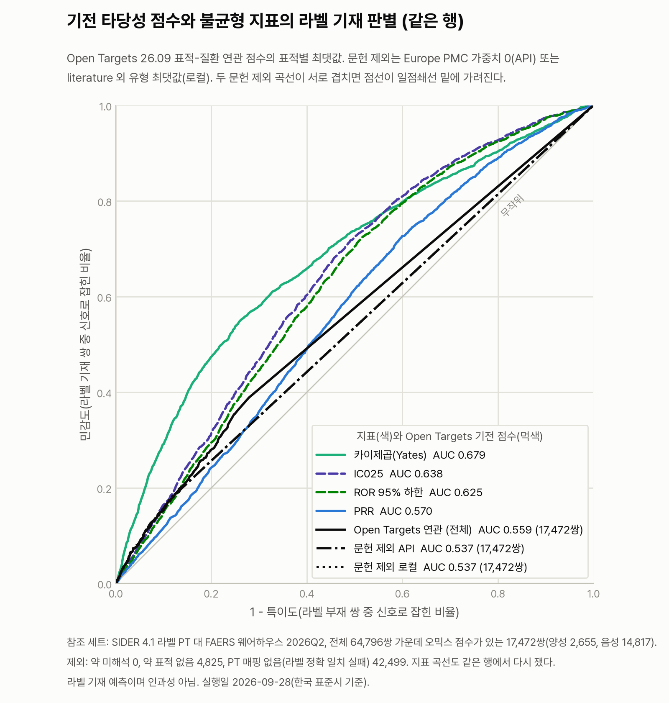

# 표적-질환 연관은 라벨 기재 쌍을 얼마나 골라내는가: 기전 타당성 축 파일럿

**읽는 사람:** 근거 등급과 신호 규칙을 맡은 팀원, 기전 타당성 축을 이어 받을 사람, 그리고 이 결과를 받아 볼
FlyVigilante 팀.

2026-09-28(한국 표준시) 측정. 약의 작용기전 표적과 이상반응 PT 사이의 표적-질환 연관 점수를 Open Targets
Platform 26.09에서 조회해 쌍마다 기전 타당성 점수를 매겼다. 그 점수가 SIDER 라벨에 적힌 쌍을 얼마나 골라내는지
불균형 지표와 같은 참조 세트, 같은 행에서 쟀다. 결과 파일은 세 시험 쌍의
`eval/results/omics_plausibility_2026-09-28.json`과 참조 세트의
`eval/results/omics_plausibility_refset_2026-09-28.json.gz`이고, 이 문서의 숫자는 모두 이 두 파일에서 왔다.

**결론을 먼저 적는다. Open Targets 26.09의 표적-질환 연관은 라벨 기재 쌍을 귀무보다 조금만 가른다.** AUC 0.559로
귀무 평균 0.532를 넘지만 폭이 작고, 문헌 근거를 뺀 점수는 0.537로 귀무 평균 0.520을 넘는 데 그친다. 같은 행에서
잰 불균형 지표 넷(0.570~0.679)보다 모두 낮다. 둘째, 평가 행의 68.4%가 점수 0이고, 점수가 0이 아닌 행의 절반 넘게는
Europe PMC 문헌 근거만으로 점수를 받았다. 이 소스는 독립된 기전 근거라기보다 그 쌍에 대해 쓰인 글을 다시 세는 쪽에
가까울 수 있다. 셋째, 먼저 풀어야 할 한계는 적용 범위다. PT 3,929개 가운데 라벨이 정확히 일치한 963개만 매핑되어,
참조 세트 64,796쌍 가운데 17,472쌍만 점수를 받았다.

## 1. 무엇을 조회했는가

소스는 Open Targets Platform GraphQL(`https://api.platform.opentargets.org/api/v4/graphql`) 하나다. 응답의 `meta`가
API 26.9.0, 데이터 26.09를 돌려주었고, 라이선스는 Open Targets 문서 페이지가 적은 CC0 1.0이다. 약 이름이 Open
Targets에서 정확히 풀리지 않을 때 ChEMBL REST로 한 번 더 찾는 대체 경로를 만들었지만, 이번 실행에서는 31종이 모두
Open Targets에서 풀려 쓰이지 않았다. 소스 조사와 선택의 근거는 `.scratch/omics-plausibility/issues/01`부터 `03`까지의
"## Answer"에 있다.

규칙은 다섯 가지다.

| 단계 | 규칙 |
|---|---|
| 약 이름 | `search(entityNames:["drug"])` 결과 가운데 이름이 입력과 대소문자 무시로 정확히 같은 것만 쓴다. 없으면 ChEMBL `molecule.json?pref_name__iexact=`, 그래도 없으면 표적 없음 |
| 표적 | `drug.mechanismsOfAction` 행에 나온 유전자를 모두 쓴다 |
| PT 매핑 | `search(entityNames:["disease"])`의 첫 결과 이름이 PT와 대소문자 무시로 정확히 같을 때만 매핑한다. 동의어 일치와 상위·하위 용어 확장은 하지 않는다 |
| 점수 | 표적별 표적-질환 연관 `score`의 최댓값(`max_score`). 연관 목록에 없으면 0 |
| 문헌 제외 점수 | 두 가지를 함께 남긴다. API 점수는 `datasources`에 `europepmc` 가중치 0을 준 값이고, 로컬 점수는 literature가 아닌 `datatypeScores`의 최댓값이다 |

API의 문헌 제외 인자는 문헌과 무관한 연관의 점수도 바꾸었다(04 티켓에서 관찰, 원인은 확인하지 않음). 그래서 로컬
규칙 점수를 따로 둔다. 이번 참조 세트에서는 두 점수의 AUC가 소수 셋째 자리까지 같았다.

**호출은 259회였다.** 참조 세트 모드는 PT 검색을 한 요청에 50개씩 묶고, 연관은 표적마다 목록 전체를 한 번 받아
로컬에서 조인한다. 단계별로 약 해석 60회(32.9초), PT 묶음 검색 79회(102.7초), 표적별 연관 목록 119회(97.5초)이고,
캐시 적중 2회, 실패 0회다. 모든 응답은 요청 본문의 sha1을 이름으로 `$OMICS_DIR/opentargets/`에 캐시하므로, 같은
명령을 다시 돌리면 `meta` 한 번만 새로 부른다.

세 시험 쌍의 조회 결과는 다음과 같다. 표적과 용어는 모두 Open Targets 26.09 응답 그대로다.

| 쌍 | 약 ID | 기전 표적 | 매핑 용어(라벨 일치) | 표적별 연관 점수 | max_score | 문헌 제외(API / 로컬) |
|---|---|---|---|---|---|---|
| NIRAPARIB · THROMBOCYTOPENIA | CHEMBL1094636 | PARP2, PARP1 | HP_0001873 Thrombocytopenia | PARP1 0.0125, PARP2 0.0055 | 0.0125 | 0 / 0 |
| CLOZAPINE · NEUTROPENIA | CHEMBL42 | HTR2A, DRD2 | MONDO_0001475 neutropenia | HTR2A 0.0015, DRD2 0(행 없음) | 0.0015 | 0 / 0 |
| ISOTRETINOIN · INFLAMMATORY BOWEL DISEASE | CHEMBL547 | RARG, RARB, RARA | MONDO_0005265 inflammatory bowel disease | RARB 0.0085, RARA 0.0069, RARG 0(행 없음) | 0.0085 | 0 / 0 |

다섯 연관 행 모두 데이터 유형이 literature 하나, 데이터 소스가 `europepmc` 하나였다. 그래서 문헌을 빼면 세 쌍
모두 0이다. 근거 ID는 `omics:opentargets@26.09:NIRAPARIB:thrombocytopenia`처럼 만들고, 근거 설명에는 "라벨 기재
예측용 기전 근거이며, 개별 사례에서 약이 반응을 일으켰다는 인과 근거가 아니다"를 넣는다.

## 2. 참조 세트 결과

참조 세트는 불균형 지표 실측(`docs/notes/metric-validation-2026-09-28.md`)과 같은
`eval/refsets/pilot_sider_2026-09-28.json.gz`, 약 31종과 64,796쌍이다. 점수를 매길 수 있는 행만 평가했다. 한 행은
첫 제외 사유 하나로만 센다.

| 항목 | 값 |
|---|---|
| 약 해석 | 31종 모두 이름 정확 일치 |
| 기전 표적이 있는 약 | 29종. CARBOPLATIN과 CYCLOPHOSPHAMIDE는 `mechanismsOfAction`에 표적이 없었다 |
| 서로 다른 표적 | 117개 |
| PT 매핑 | 3,929개 가운데 963개(24.5%). 첫 결과 이름이 다른 것 2,061개, 결과 없음 905개 |
| 제외: 약 표적 없음 | 4,825쌍 |
| 제외: PT 매핑 없음 | 42,499쌍 |
| 평가 행 | 17,472쌍. 양성(라벨 기재) 2,655, 음성(라벨 부재) 14,817 |

평가 행에서 점수가 0보다 큰 비율은 다음과 같다.

| 클래스 | 행 | 연관 있음(max_score > 0) | 문헌 제외 API > 0 | 문헌 제외 로컬 > 0 |
|---|---|---|---|---|
| 양성(라벨 기재) | 2,655 | 1,090 (41.1%) | 568 (21.4%) | 568 (21.4%) |
| 음성(라벨 부재) | 14,817 | 4,427 (29.9%) | 2,108 (14.2%) | 2,108 (14.2%) |

AUC는 모두 같은 17,472행에서 쟀다. 귀무는 불균형 지표 실측과 같은 방식으로, 양성 쌍의 PT를 약 사이에 뒤섞은
"귀무 양성"으로 100회 쟀다. 시드는 20260928부터 20261027까지이고, 귀무 양성은 매번 2,655쌍이었다.

| 점수 | AUC | 귀무 AUC 평균 [2.5, 97.5 백분위] |
|---|---|---|
| Open Targets 연관 max_score | 0.559 | 0.532 [0.526, 0.541] |
| 문헌 제외 API | 0.537 | 0.520 [0.515, 0.526] |
| 문헌 제외 로컬 | 0.537 | 0.520 [0.515, 0.526] |
| PRR | 0.570 | 0.484 [0.476, 0.491] |
| ROR 95% 하한 | 0.625 | 0.536 [0.529, 0.543] |
| IC025 | 0.638 | 0.549 [0.542, 0.556] |
| 카이제곱 (Yates) | 0.679 | 0.645 [0.635, 0.652] |



## 3. 어떻게 읽는가

**기전 축은 귀무를 넘지만 폭이 작고, 불균형 지표보다 낮다.** max_score의 AUC 0.559는 귀무 97.5 백분위 0.541 위에
있다. 그러나 귀무 평균과의 차이는 0.028이다. 같은 행에서 PRR, ROR 하한, IC025는 귀무 평균보다 0.086~0.089 높다.
문헌 제외 점수의 차이는 0.017로 더 작다. 이 행들에서 표적-질환 연관은 라벨 기재 여부에 대해 불균형 지표보다 적은
정보를 준다.

**점수 대부분이 0이고, 0이 아닌 점수의 절반 넘게는 문헌에서만 왔다.** 평가 17,472행 가운데 11,955행(68.4%)이 점수
0이다. 그래서 ROC 곡선의 대부분이 직선이다. 점수가 0보다 큰 5,517행 가운데 2,841행은 문헌 제외 점수가 0이다. 이
행들의 점수는 Europe PMC 문헌 근거 하나에서 나왔다. 세 시험 쌍도 모두 이 경우였다.

**문헌 근거가 이상반응 보고를 되세는 것일 수 있다.** 02 티켓이 적은 대로 문헌 근거는 표적과 질환의 문헌 동시
언급이다. 그 글 가운데 약물 이상반응 증례 보고나 약물감시 논문이 있으면, 점수는 "생물학적으로 그럴 수 있다"가
아니라 "이미 보고되었다"를 다시 센다. 그러면 라벨 기재를 예측하는 힘의 일부는 라벨과 같은 보고에서 온다. 이번
측정은 이 가능성을 확인하지 않았다. 반대 쪽 증거도 있다. 문헌을 뺀 점수도 양성의 21.4%, 음성의 14.2%에서 0보다
크고 귀무를 조금 넘으므로, 문헌만으로 설명되지는 않는다. 가능성을 가르려면 두 가지를 해 볼 수 있다. 하나는
문헌을 쓰지 않는 표적-질환 연관 소스로 같은 측정을 하는 것이다. 다른 하나는
문헌 근거에서 이상반응 보고를 다룬 글을 빼고 점수를 다시 계산하는 것이다.

**먼저 고칠 것은 적용 범위다.** 참조 세트 64,796쌍 가운데 27%만 점수를 받았고, 빠진 42,499쌍은 모두 PT 매핑
실패다. 매핑 규칙이 첫 검색 결과의 이름 정확 일치만 인정하기 때문이다. 늘리는 방법은 세 가지다. 첫째, 검색 결과의
동의어 일치를 인정한다. 둘째, 매핑이 안 된 PT를 상위 용어로 올려 잡는다. 셋째, MedDRA와 질환 온톨로지 사이의
교차 참조로 잇는다. 02 티켓에서 EFO, MONDO, HP 응답 어디에도 MedDRA 교차 참조가 없었으므로, 셋째 방법은 UMLS 같은
라이선스가 필요한 소스를 거쳐야 한다. 적용 범위를 넓히면 AUC도 바뀔 수 있으므로, 지금의 0.559는 매핑이 쉬운 PT에
한정된 값으로 읽는다.

## 4. 이것이 아닌 것

- **개별 사례의 인과가 아니다.** 양성은 SIDER 라벨 기재이고 음성은 라벨 부재다. 수치는 라벨 기재를 얼마나
  맞히는지다. FlyVigilante PR의 과잉해석 규칙 R13은 기준 성능과 근거 등급이 집단 수준의 서술이며 개별 케이스의
  인과를 세우지 않는다고 적는다. 기전 점수에도 같은 제한을 걸 규칙 문장("기전 타당성은 개별 사례 인과가 아님")을
  계획하고 있고, 아직 반영하지 않았다.
- **표적은 한 소스의 "작용기전" 표적이다.** Open Targets `drug.mechanismsOfAction`의 표적만 썼다. 결합 활성 전체나
  비표적 효과는 들어가지 않는다. 표적 수는 약마다 크게 다르다(METFORMIN 51개, PREGABALIN 26개, 나머지 1~4개).
  표적이 많은 약은 최댓값을 쓰는 규칙에서 점수가 0보다 클 기회가 많다.
- **표적 없는 약은 0점이 아니라 제외다.** CARBOPLATIN과 CYCLOPHOSPHAMIDE의 4,825쌍은 점수 0으로 넣지 않고 뺐다.
  0으로 넣는 변형은 돌리지 않았다.
- **여러 온톨로지 용어를 같은 등급으로 다뤘다.** 매핑된 963개는 MONDO 610개, HP 212개, EFO 135개, GO 3개, OTAR,
  MP, NCIT 각 1개다. 질환 용어와 표현형 용어의 연관 점수를 구별하지 않고 한 척도로 썼다.
- **쪽 넘김 불일치가 한 표적에 있었다.** EDNRA(ENSG00000151617)는 연관 4,504개를 두 쪽으로 받았는데, 한 질환이 문헌
  제외 별칭에만 나왔다. 그 질환의 기본 점수는 0으로 들어갔다. 원인은 확인하지 않았고 영향은 질환 하나다.
- **파일럿이다.** 약 31종, 소스 하나, 연관 축 하나다. 조직 발현 축은 아직 없다.

## 5. 돌리는 법

계산은 컴퓨트 노드에서 한다. 파일 이름의 날짜를 `date.today()`로 정하므로 `TZ=Asia/Seoul`을 건다. 캐시 경로는
`OMICS_DIR` 환경 변수로만 준다. `srun`은 현재 환경 변수를 넘기므로 `export`한 값이 그대로 쓰인다.

```bash
export TZ=Asia/Seoul
export OMICS_DIR=<자기 스크래치 경로>/omics-plausibility   # 예: 소속 스토리지 아래 tmp

# 1) 세 시험 쌍. 출력은 eval/results/omics_plausibility_<날짜>.json
srun -A rsc -p cpu-core -c 1 --mem=7500M -t 00:15:00 \
    .venv/bin/python scripts/omics_plausibility.py

# 2) 참조 세트. 지표 값은 참조 세트 옆 _pairs.tsv.gz 에서 읽는다.
#    출력은 eval/results/omics_plausibility_refset_<날짜>.json 이고, 저장소에는 gzip 으로 넣는다.
srun -A rsc -p cpu-core -c 2 --mem=8G -t 00:30:00 \
    .venv/bin/python scripts/omics_plausibility.py \
    --refset eval/refsets/pilot_sider_2026-09-28.json.gz --sleep 0.2
gzip -n -9 eval/results/omics_plausibility_refset_2026-09-28.json

# 캐시만으로 다시 돌려 보려면 --dry-run 을 붙인다. 네트워크로 나가지 않는다.

# 3) 그림. 저장소 .venv 에는 matplotlib 이 없으므로 matplotlib 이 있는 파이썬으로 그린다
#    (예: 불균형 지표 노트의 $M/venv-fv/bin/python). --omics 는 .json 과 .json.gz 를 모두 읽는다.
MPLCONFIGDIR=$OMICS_DIR/mpl <matplotlib 있는 python> scripts/plot_metric_roc.py \
    --results eval/results/metric_validation_2026-09-28.json \
    --omics eval/results/omics_plausibility_refset_2026-09-28.json.gz
```

테스트는 `env -u NVIDIA_API_KEY .venv/bin/python -m pytest -q -m "not network"`이다.
`tests/test_omics_plausibility.py`는 네트워크 없이 캐시 재생과 파서만 시험한다.

## 6. 출처

- Open Targets Platform GraphQL, `https://api.platform.opentargets.org/api/v4/graphql`, API 26.9.0, 데이터 26.09.
  라이선스는 `https://platform-docs.opentargets.org/licence`의 CC0 1.0이다. 같은 페이지의 데이터 소스 표는 ChEMBL을
  CC BY-SA 3.0으로 적는다. 01 티켓은 Open Targets 기전 행이 ChEMBL 응답과 글자까지 같았다고 기록했다.
- ChEMBL REST, `https://www.ebi.ac.uk/chembl/api/data`, ChEMBL_37. 01 티켓에서 표적 교차 확인에 썼고, 이번 실행의
  대체 경로로는 쓰이지 않았다.
- 원 응답 캐시는 `$OMICS_DIR/opentargets/<요청 본문 sha1>.json`(ChEMBL은 `$OMICS_DIR/chembl/<URL sha1>.json`)이다.
  결과 JSON의 요청마다 `cache_path`가 적혀 있다. 이번 실행의 캐시는 소속 스토리지에 있고 저장소에는 넣지 않는다.
- 결과 `eval/results/omics_plausibility_2026-09-28.json`(세 쌍)과
  `eval/results/omics_plausibility_refset_2026-09-28.json.gz`(참조 세트, 행 표 포함). 생성 스크립트는
  `scripts/omics_plausibility.py`, 그림은 `scripts/plot_metric_roc.py --omics`다.
- 참조 세트 `eval/refsets/pilot_sider_2026-09-28.json.gz`와 지표 표 `eval/refsets/pilot_sider_2026-09-28_pairs.tsv.gz`.
  정의는 `docs/notes/metric-validation-2026-09-28.md` 1절에 있다.
- 소스 조사와 결정 기록은 `.scratch/omics-plausibility/issues/01`부터 `05`까지의 "## Answer"다.
